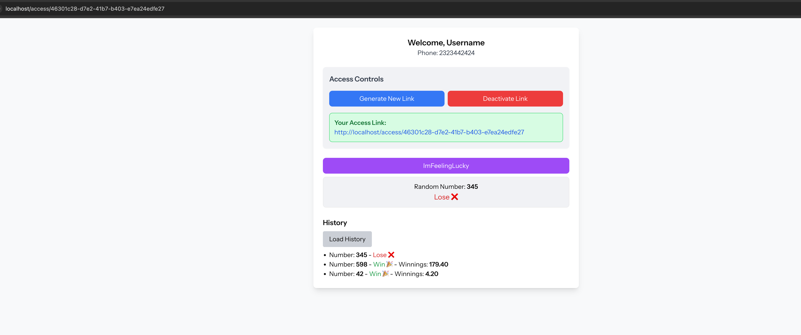

# nux-games.test

## Preview



## Requirements

- Docker
- Docker Compose
- Git

---

## Step 1: Clone the repository

```bash
git clone https://github.com/o-nasteka/nux-games.test.git
cd nux-games.test
```

---

## Step 2: Configure `.env` files

### 2.1 Laravel `.env`

```bash
cp .env.example .env
```

> Make sure `DB_CONNECTION=sqlite`  
> And that the file `database/database.sqlite` exists (or create it manually)

---

### 2.2 Docker `.env`

```bash
cp docker/.env.example docker/.env
```

> Required for correct project volume mounting in the container

---

## Step 3: Build and Run Docker containers

```bash
cd docker
docker compose up -d --build
```

---

## Step 4: Set up Laravel

```bash
docker compose exec app bash
```

Inside the container, run:

```bash
composer install &&
php artisan key:generate &&
php artisan migrate &&
php artisan storage:link &&
npm install &&
npm run build 
```

---

## Step 5: Access the application

Open [http://localhost](http://localhost) in your browser.

---

